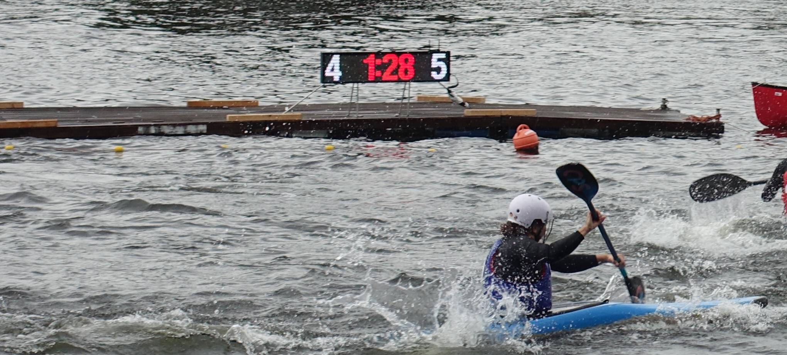

Canoe Polo Scoreboard
=====================

A Scoreboard built of LED Matrix modules that are controlled by a Rasperry Pi.
The Software is based on the great library https://github.com/hzeller/rpi-rgb-led-matrix of  Henner Zeller <h.zeller@acm.org>, licensed with
[GNU General Public License Version 2.0](http://www.gnu.org/licenses/gpl-2.0.txt)

For more information see the [wiki page](../../wiki).
