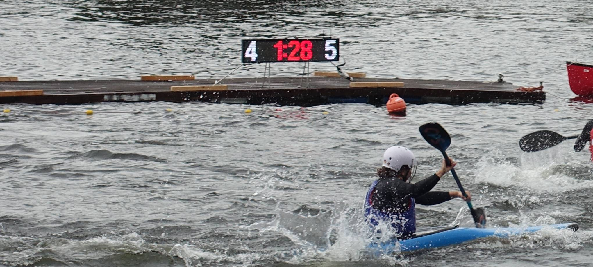
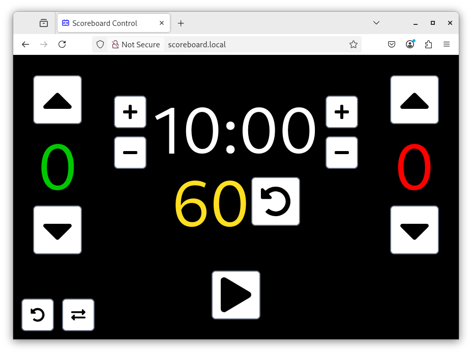
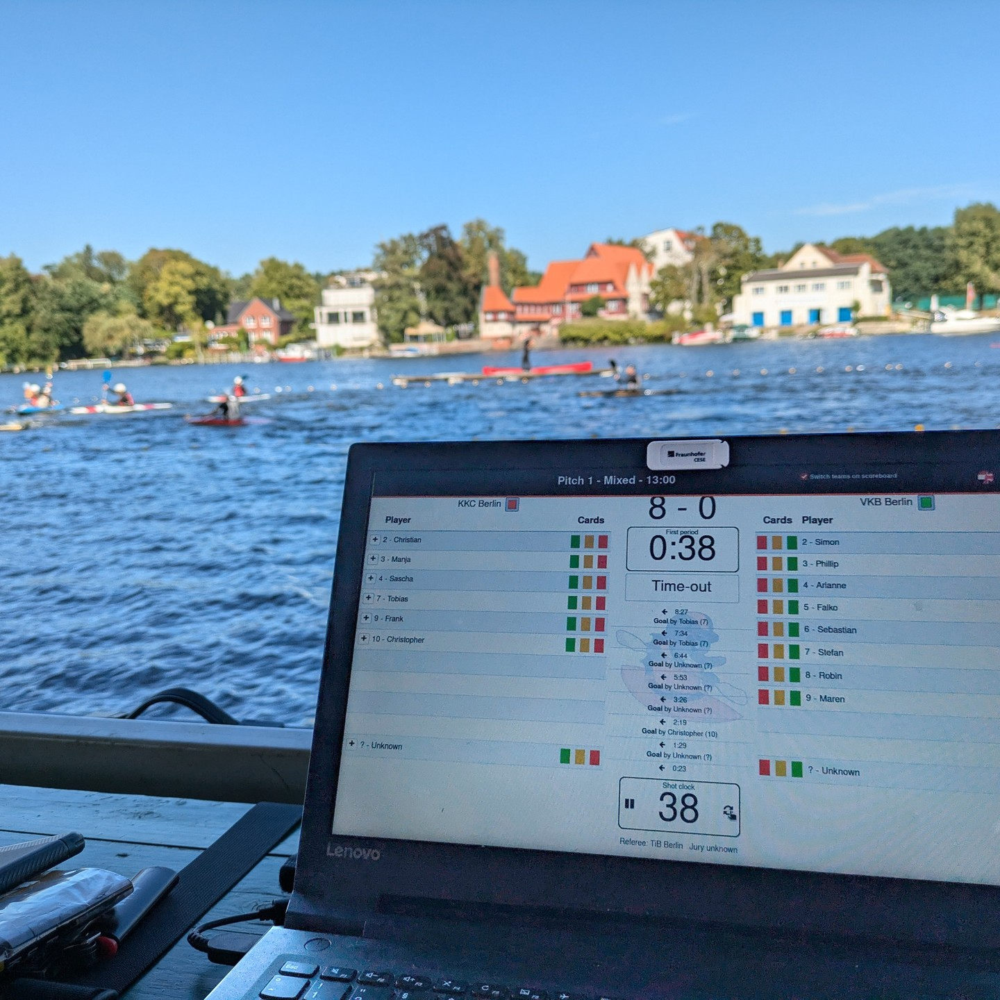

Canoe Polo Scoreboard
=====================

A Scoreboard built of LED Matrix modules that are controlled by a Rasperry Pi.
The Software is based on the great library https://github.com/hzeller/rpi-rgb-led-matrix of  Henner Zeller <h.zeller@acm.org>, licensed with
[GNU General Public License Version 2.0](http://www.gnu.org/licenses/gpl-2.0.txt)

>

## Options to control the Display

### Wireless Keyboard (Numpad)

>

- Install an external antenna

### Web Control (web site running on the Scoreboard's Raspberry Pi)

1. Install a web server (Apache e.g.) on the Raspberry Pi
2. Clone the build branch of https://github.com/LariWa/scoreboard_web-app and copy the content to the web servers html directory.

### Kayakers.nl Cockpit

1. Install this addon in Firefox: https://github.com/LariWa/scoreboard_cockpit-control
2. Create tournament on https://www.kayakers.nl

For more information see the [wiki page](../../wiki).

## Building

1. Set up the Raspberry Pi  
Pay attention to these notes: https://github.com/hzeller/rpi-rgb-led-matrix#Troubleshooting  
Note: The config file has moved in Debian Bookworm to `/boot/firmware/config.txt`  
If this does not work you can blacklist the kernel module for the sound chip:  
`echo "blacklist snd_bcm2835" | sudo tee /etc/modprobe.d/blacklist-snd_bcm2835.conf`

2. Install required packages  
`sudo apt install -y git libncurses5-dev`

3. Clone repository  
`git clone https://github.com/hansu/rpi-canoepolo-scoreboard.git`

4. Build it  
`cd rpi-canoepolo-scoreboard`  
`make -C scoreboard -j`  
Note: the included libws libray is for 32 bit only. Use the branch "64-bit" if you use a 64 bit OS.

5. Run it  
`cd rpi-canoepolo-scoreboard/scoreboard`  
`sudo ./scoreboard`
